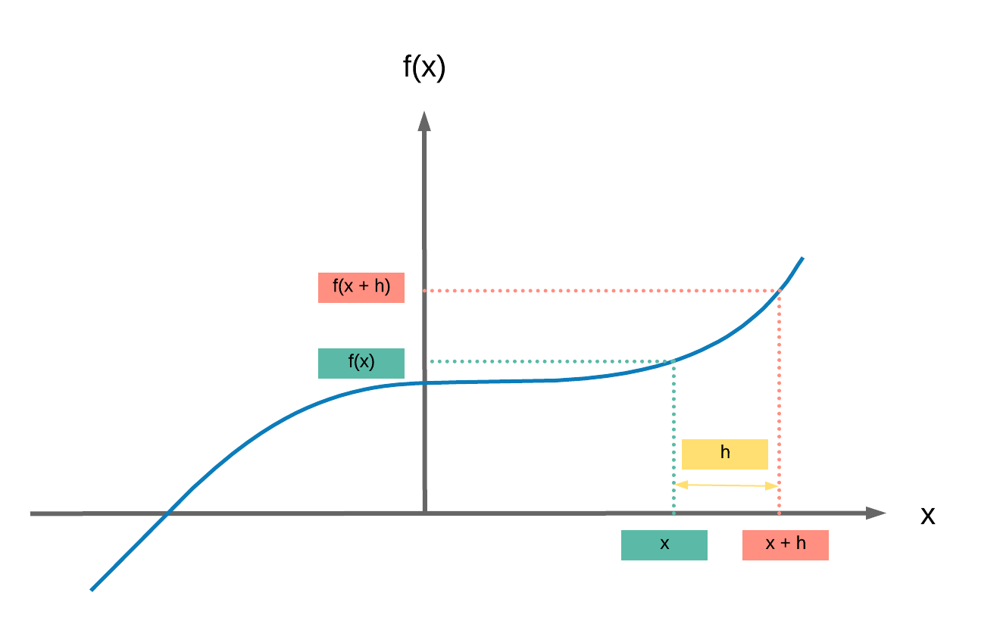

# Derivative, Gradient and Jacobian

## Simplified Equation
- This is the simplified equation we have been using on how we update our parameters to reach good values (good local or global minima)
- $\theta = \theta - \eta \cdot \nabla_\theta$
    - $\theta$: parameters (our tensors with gradient accumulation abilities)
    - $\eta$: learning rate (how fast we want to learn)
    - $\nabla_\theta$: gradients of loss with respect to the model's parameters
- Even simplier equation in English: `parameters = parameters - learning_rate * parameters_gradients`
- This process can be broken down into 2 sequential parts
    1. Backpropagation
    2. Gradient descent
 
## Simplified Equation Breakdown
- Our simplified equation can be broken down into 2 parts
    1. Backpropagation: getting our gradients
        - Our partial derivatives of loss (scalar number) with respect to (w.r.t.) our model's parameters and w.r.t. our input
        - Backpropagation gets us $\nabla_\theta$ which is our gradient
    2. Gradient descent: using our gradients to update our parameters
        - Somehow, the terms backpropagation and gradient descent are often mixed together. But they're totally different. 
        - Gradient descent relates to using our gradients obtained from backpropagation to update our weights.
        - Gradient descent: $\theta = \theta - \eta \cdot \nabla_\theta$

## Steps
- Derivatives
- Partial Derivatives
- Gradient
- Gradient, Jacobian and Generalized Jacobian Differences
- Backpropagation: computing gradient without
- Gradient descent: using gradient to update parameters

### Derivative
- Given a simple cubic equation: $f(x) = 2x^3 + 5$
- Calculating the derivative $\frac{df(x)}{dx}$ is simply calculating the difference in values of $y$ for an extremely small (infinitesimally) change in value of $x$ which is frequently labelled as $h$
    - $\frac{df(x)}{dx} = \displaystyle{\lim_{h \to 0}} \frac{f(x + h) - f(x)}{h}$
        - $\frac{f(x + h) - f(x)}{h}$ is the slope formula similar to what you may be familiar with:
            - Change in $y$ over change in $x$: $\frac{\Delta y}{\Delta x}$
        - And the derivative is the slope when $h \rightarrow 0$, in essence a super teeny small $h$
        - 
- Let's break down $\frac{df}{dx} = \displaystyle{\lim_{h \to 0}} \frac{f(x + h) - f(x)}{h}$
    - $\displaystyle{\lim_{h \to 0} \frac{f(x + h) - f(x)}{h}}$
    - $\displaystyle{\lim_{h \to 0} \frac{(2(x+h)^3 + 5) - 2x^3 + 5}{h}}$
    - $\displaystyle{\lim_{h \to 0} \frac{2(x^2 + 2xh + h^2)(x+h) - 2x^3}{h}}$
    - $\displaystyle{\lim_{h \to 0} \frac{2(x^3 + 2x^2h + h^3 + x^2h + 2xh^2 + h^3) - 2x^3}{h}}$
    - $\displaystyle{\lim_{h \to 0}\frac{2(x^3 + 3x^2h + h^3 + 2xh^2) - 2x^3}{h}}$
    - $\displaystyle{\lim_{h \to 0} \frac{6x^2h + h^3 + 2xh^2}{h}}$
    - $\displaystyle{\lim_{h \to 0} 6x^2 + h^2 + 2xh} = 6x^2$

### Partial Derivative 
- Ok, it's simple to calculate our derivative when we've only one variable in our function. 
- If we've more than one (as with our parameters in our models), we need to calculate our partial derivatives of our function with respect to our variables
- Given a simple equation $f(x, z) = 4x^4z^3$, let us get our partial derivatives
- 2 parts: partial derivative of our function w.r.t. x and z
    1. Partial derivative of our function w.r.t. x: $\frac{\delta f(x, z)}{\delta x}$
        - Let $z$ term be a constant, $a$ 
        - $f(x, z) = 4x^4a$
        -  $\frac{\delta f(x, z)}{\delta x} = 16x^3a$
        - Now we substitute $a$ with our z term, $a = z^3$
        - $\frac{\delta f(x, z)}{\delta x} = 16x^3z^3$
    2. Partial derivative of our function w.r.t. z: $\frac{\delta f(x, z)}{\delta z}$
        - Let $x$ term be a constant, $a$
        - $f(x, z) = 4az^3$
        - $\frac{\delta f(x, z)}{\delta z} = 12az^2$
        - Now we substitute $a$ with our $x$ term, $a = x^4$
        - $\frac{\delta f(x, z)}{\delta z} = 12x^4z^2$
- Ta da! We made it, we calculated our partial derivatives of our function w.r.t. the different variables

### Gradient
- We can now put all our partial derivatives into a vector of partial derivatives
    - Also called "gradient"
    - Represented by $\nabla_{(x,z)}$
- $\nabla_{(x,z)} = \begin{bmatrix} \frac{df(x,z)}{dx} \\ \frac{df(x,z)}{dz} \end{bmatrix} = \begin{bmatrix} 16x^3z^3 \\ 12x^4z^2 \end{bmatrix}$
- It is critical to note that the term gradient applies for $f : \mathbb{R}^N \rightarrow \mathbb{R}$
    - Where our function maps a vector input to a scalar output: in deep learning, our loss function that produces a scalar loss
    
### Gradient, Jacobian, and Generalized Jacobian
In the case where we have non-scalar outputs, these are the right terms of matrices or vectors containing our partial derivatives

1. Gradient: vector input to scalar output
    - $f : \mathbb{R}^N \rightarrow \mathbb{R}$
2. Jacobian: vector input to vector output
    - $f : \mathbb{R}^N \rightarrow \mathbb{R}^M$
3. Generalized Jacobian: tensor input to tensor output
    - In this case, a tensor can be any number of dimensions.
    

## Summary
We've learnt to...

!!! success
    * [x] Calculate derivatives
    * [x] Calculate partial derivatives
    * [x] Get gradients
    * [x] Differentiate the concepts amongst gradients, Jacobian and Generalized Jacobian

Now it is time to move on to backpropagation and gradient descent for a simple 1 hidden layer FNN with all these concepts in mind.

## Citation
If you have found these useful in your research, presentations, school work, projects or workshops, feel free to cite using this DOI.

 