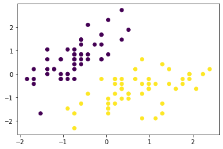

# Logistic Regression from Scratch

This is an implementation of a simple logistic regression for binary class labels. We will be attempting to classify 2 flowers based on their petal width and height: setosa and versicolor.

## Imports


```python
%matplotlib inline
import matplotlib.pyplot as plt
import numpy as np

import torch
import torch.nn.functional as F

from sklearn import datasets
from sklearn import preprocessing
from sklearn.model_selection import train_test_split
from collections import Counter
```

## Preparing a custom 2-class IRIS dataset

### Load Data


```python
# Instantiate dataset class and assign to object
iris = datasets.load_iris()

# Load features and target
# Take only 2 classes, and 2 features (sepal length/width)
X = iris.data[:-50, :2]
X = preprocessing.scale(X)
y = iris.target[:-50] 
```

### Print Data Details


```python
# 50 of each iris flower
print(Counter(y))

# Type of flower
print(list(iris.target_names[:-1]))

# Shape of features
print(X.shape)
```

    Counter({0: 50, 1: 50})
    ['setosa', 'versicolor']
    (100, 2)


### Scatterplot 2 Classes


```python
plt.scatter(X[:, 0], X[:, 1], c=y);
```





### Train/Test Split


```python
X_train, X_test, y_train, y_test = train_test_split(X, y, test_size=0.2)
print(f'X train size: {X_train.shape}')
print(f'X test size: {X_test.shape}')
print(f'y train size: {y_train.shape}')
print(f'y test size: {y_test.shape}')

# Distribution of both classes are roughly equal using train_test_split function
print(Counter(y_train))
```

    X train size: (80, 2)
    X test size: (20, 2)
    y train size: (80,)
    y test size: (20,)
    Counter({0: 41, 1: 39})


## Python Implementation
- Forwardpropagation:
    - Affine function/transformation: $z = wx + b$
    - Sigmoid/logistic function: $\hat y = \frac{1}{1 + e^{-z}}$
- Backwardpropagation:
    - Loss: $l = ylog(\hat y) + (1-y) log (1 - \hat y)$
    - Partial derivative of loss w.r.t weights: $\frac{\delta L}{\delta w} =\frac{\delta L}{\delta z} \frac{\delta z}{\delta w} = (\hat y - y)(x^T)$
    - Partial derivative of loss w.r.t. bias: $\frac{\delta L}{\delta b} = \frac{\delta L}{\delta z} \frac{\delta z}{\delta b} = (\hat y - y)(1)$
    - $\frac{\delta L}{\delta z} = \hat y - y$
    - $\frac{\delta z}{\delta w} = x$
    - $\frac{\delta z}{\delta b} = 1$
- Gradient descent: updating weights
    - $w = w - \alpha (\hat y - y)(x^T)$
    - $b = b - \alpha (\hat y - y).1$


### Training


```python
X_train, X_test, y_train, y_test = train_test_split(X, y, test_size=0.2)
print(f'X train size: {X_train.shape}')
print(f'X test size: {X_test.shape}')
print(f'y train size: {y_train.shape}')
print(f'y test size: {y_test.shape}')

# Distribution of both classes are roughly equal using train_test_split function
print(Counter(y_train))

#### REMOVE ABOVE

num_epochs = 20
learning_rate = 0.1
num_features = X.shape[1]
weights = torch.zeros(num_features, 1, dtype=torch.float32)
bias = torch.zeros(1, dtype=torch.float32)

X_train = torch.from_numpy(X_train).type(torch.float32)
y_train = torch.from_numpy(y_train).type(torch.float32)

for epoch in range(num_epochs):        
    # 1. Forwardpropagation:
    # 1a. Affine Transformation: z = ax + b
    z = torch.add(torch.mm(X_train, weights), bias)
    # 2a. Sigmoid/Logistic Function: y_hat = 1 / (1 + e^{-z})
    y_hat = 1. / (1. + torch.exp(-z))
    
    # Backpropagation:
    # 1. Calculate binary cross entropy 
    l = torch.mm(-y_train.view(1, -1), torch.log(y_hat)) - torch.mm((1 - y_train).view(1, -1), torch.log(1 - y_hat))
    
    # 2. Calculate dl/dz
    dl_dz = y_train - y_hat.view(-1)
    
    # 2. Calculate partial derivative of cost w.r.t weights (gradients)
    # dl_dw = dl_dz dz_dw = (y_hat - y)(x^T)
    grad = torch.mm(X_train.transpose(0, 1), dl_dz.view(-1, 1))
    
    # Gradient descent:
    # update our weights and bias with our gradients
    weights += learning_rate * grad
    bias += learning_rate * torch.sum(dl_dz)

    # Accuracy
    total = y_hat.shape[0]
    predicted = (y_hat > 0.5).float().squeeze()
    correct = (predicted == y_train).sum()
    acc = 100 * correct / total 
    
    # Print accuracy and cost
    print(f'Epoch: {epoch} | Accuracy: {acc.item() :.4f} | Cost: {l.item() :.4f}')

print(f'Weights \n {weights.data}')
print(f'Bias \n {bias.data}')
```

    X train size: (80, 2)
    X test size: (20, 2)
    y train size: (80,)
    y test size: (20,)
    Counter({1: 41, 0: 39})
    Epoch: 0 | Accuracy: 48.0000 | Cost: 55.4518
    Epoch: 1 | Accuracy: 100.0000 | Cost: 5.6060
    Epoch: 2 | Accuracy: 100.0000 | Cost: 5.0319
    Epoch: 3 | Accuracy: 100.0000 | Cost: 4.6001
    Epoch: 4 | Accuracy: 100.0000 | Cost: 4.2595
    Epoch: 5 | Accuracy: 100.0000 | Cost: 3.9819
    Epoch: 6 | Accuracy: 100.0000 | Cost: 3.7498
    Epoch: 7 | Accuracy: 100.0000 | Cost: 3.5521
    Epoch: 8 | Accuracy: 100.0000 | Cost: 3.3810
    Epoch: 9 | Accuracy: 100.0000 | Cost: 3.2310
    Epoch: 10 | Accuracy: 100.0000 | Cost: 3.0981
    Epoch: 11 | Accuracy: 100.0000 | Cost: 2.9794
    Epoch: 12 | Accuracy: 100.0000 | Cost: 2.8724
    Epoch: 13 | Accuracy: 100.0000 | Cost: 2.7754
    Epoch: 14 | Accuracy: 100.0000 | Cost: 2.6869
    Epoch: 15 | Accuracy: 100.0000 | Cost: 2.6057
    Epoch: 16 | Accuracy: 100.0000 | Cost: 2.5308
    Epoch: 17 | Accuracy: 100.0000 | Cost: 2.4616
    Epoch: 18 | Accuracy: 100.0000 | Cost: 2.3973
    Epoch: 19 | Accuracy: 100.0000 | Cost: 2.3374
    Weights 
     tensor([[ 4.9453],
            [-3.6849]])
    Bias 
     tensor([0.5570])


### Inference


```python
# Port to tensors
X_test = torch.from_numpy(X_test).type(torch.float32)
y_test = torch.from_numpy(y_test).type(torch.float32)

# 1. Forwardpropagation:
# 1a. Affine Transformation: z = ax + b
z = torch.add(torch.mm(X_test, weights), bias)
# 2a. Sigmoid/Logistic Function: y_hat = 1 / (1 + e^{-z})
y_hat = 1. / (1. + torch.exp(-z))
    
total = y_test.shape[0]
predicted = (y_hat > 0.5).float().squeeze()
correct = (predicted == y_test).sum()
acc = 100 * correct / total 

# Print accuracy
print(f'Validation Accuracy: {acc.item() :.4f}')
```

    Validation Accuracy: 100.0000

